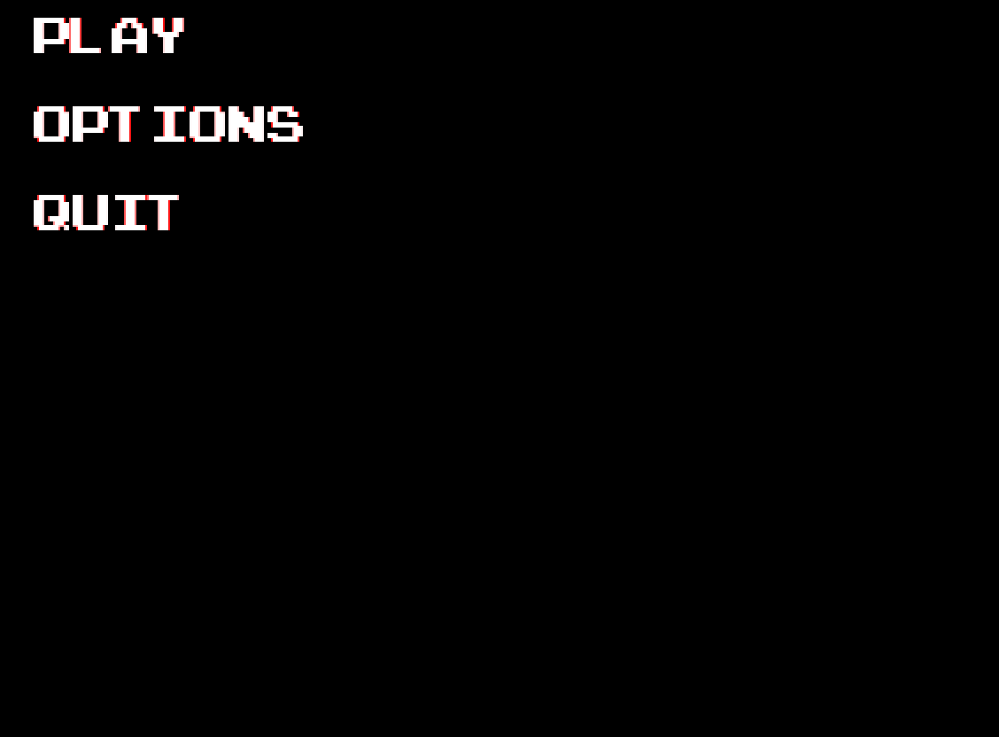

# **nhefner_pygame_menus**
These python modules provide an easy way to implement a menu system for games written with the python library pygame.

### About These Modules
This menu system is built using pygames existing modules. GUI elements are represented using pygame's Sprite module.

Here is a list of the tools provided by nhefner_pygame_menus:

**ButtonPicture:** This class provides functionality for a button represented by a picture. The user can use the add_action method on this class to attatch callback functions that will be executed when this button is pressed.

**ButtonText:** This class provides functionality for a button represented by text (string). The user can use the add_action method on this class to attatch callback functions that will be executed when this button is pressed.

**Picture:** This class allows for adding images to the menu system. It has none of the capabilities of ButtonPicture and is purely for aesthetic purposes.

**Text:** This class allows for adding text to the menu system. It has none of the capabilities of ButtonText and is purely for aesthetic purposes.

**Page:** This class represents one page of the menu system. The programmer can add instances of ButtonPicture, ButtonText, Picture, or Text to a Page object.

**MenuManager:** This class is the brains of the menu system. The programer can add instances of Page to the MenuManager.
